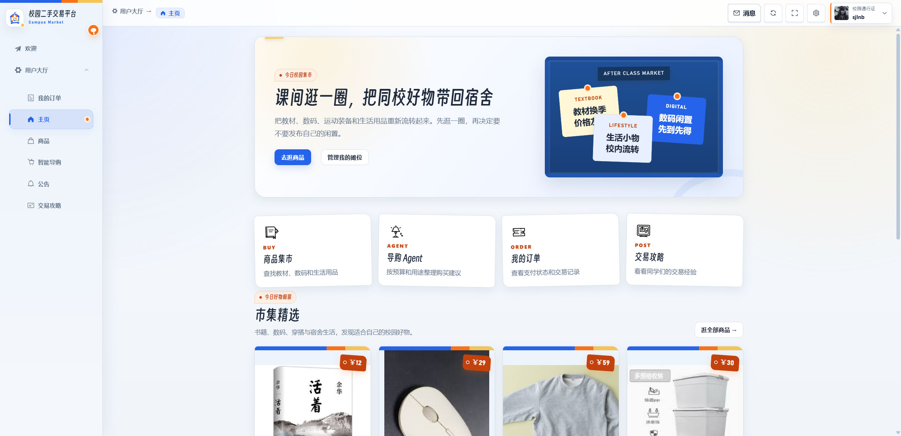
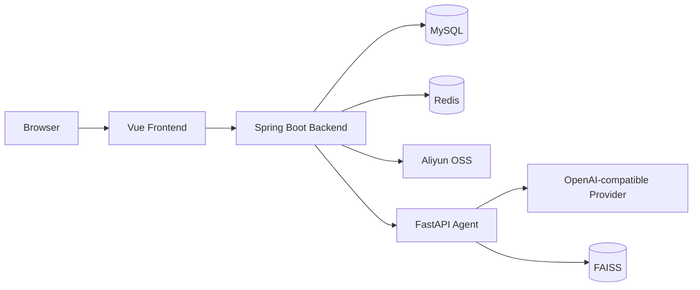

<p align="center">
  
</p>

# 智能 AI 校园二手交易平台 v1.0

<p align="center">
  
</p>

一个面向校园场景的二手交易平台，覆盖商品浏览与交易、校园币模拟支付、攻略社区、公告、私信和个人内容管理，并提供结合实时商品数据与知识检索的多轮 AI 导购。

项目采用 **Vue 3 前端 + Spring Boot 主后端 + FastAPI AI Agent** 三服务架构。

## 核心功能

### 用户端

- 用户注册、登录、退出和个人资料维护。
- 商品列表、详情、搜索、收藏、评分、购买和校园币支付。
- 个人订单、购物日历、公告和私信。
- 攻略 Post 的浏览、搜索、发布、编辑、点赞、收藏和嵌套评论。
- 多轮 AI 导购、会话归档与恢复、购买条件、商品推荐、引用来源和相关帖子。

### 管理端

- 用户、商品、商品类别和订单管理。
- 公告与攻略 Post 管理。
- 校园币发放和单次发放上限控制。

### AI 导购

- 结合用户需求、实时商品信息和脱敏偏好生成推荐。
- 使用 GUIDE 文档与社区 Post 构建 FAISS 检索索引。
- 推荐结果由 Java 后端校验商品和 Post 信息后再返回前端。
- 模型只使用商品搜索和当前用户脱敏偏好两个只读工具。

## 系统架构



- 浏览器只访问 Java 后端，不直接调用 Python Agent。
- Java 负责鉴权、业务数据、AI 会话以及最终返回结果的校验和整理。
- Python 负责模型编排与 RAG，不直接连接业务 MySQL。
- Java 与 Python 必须配置相同的 `AI_AGENT_INTERNAL_TOKEN`。

### 一次 AI 导购的数据流

```
前端(agentGuide) ──> Java /ai/conversations ──> Python /agent/v1/runs
     ▲                                            │ Router → RAG → 生成
     │  <—— AiChatVO（回答+来源+推荐）<───────────┘
         └ Java 确认商品仍可售、Post 版本仍有效后返回
```

- 交互为**同步请求 + 前端打字机动画**（非流式）。
- 每次发送消息时都会携带购买需求（预算/场景/偏好/避雷项）。
- 最多携带最近 5 轮历史对话。Java 使用 CAS 更新消息状态，并通过行锁避免并发重复处理。

## 三服务详述

| 模块 | 说明 | README |
| --- | --- | --- |
| `market_frontend` | Vue 3 用户端与管理端 | [前端 README](market_frontend/README.md) |
| `market_backend` | Java 主后端（业务/鉴权/AI 编排） | [Java 后端 README](market_backend/README.md) |
| `ai_agent_service` | Python Agent + RAG | [Python Agent README](ai_agent_service/README.md) |

### 项目结构

```text
sharing-market-v1.0/
├── market_frontend/          # Vue 前端
│   └── src/views/user/agentGuide/   # 智能导购（多轮 AI 会话 UI）
├── market_backend/           # Java 主后端
│   ├── src/main/java/com/pmsjl/     # controller/service/mapper/manager（含 Java 调用 Python 的客户端）
│   └── sql/                           # MySQL 完整数据库初始化脚本
└── ai_agent_service/         # Python Agent + 知识库 + 评测
    ├── app/                  # FastAPI（routing/rag/services/prompts/clients）
    ├── knowledge/
    │   ├── documents/effective/  # 当前使用的 GUIDE 文档
    │   └── runtime/              # 程序运行所需的知识元数据
    └── evaluation/           # 公开评测集与评测脚本
```

## 评测（Golden Test）

平台 AI 导购依赖 LLM 意图路由和知识检索，任一环节的改动都可能在不易察觉的情况下影响回答质量。`ai_agent_service/evaluation/` 提供了**经人工审核的固定评测题目 + 五阶段端到端评测**：

```
Router(意图路由) → Retrieval(向量检索) → Generation(答案生成) → Judge(自动裁判) → Final(合并判定)
```

- **题目集**：共 200 题（dev 140 + test 60），按课程/二手/平台/边界/校园五个领域分层。test 中的 60 题是不参与开发调试的独立测试集。完整评测集不随仓库发布（`evaluation/dataset/`，不进 Git）；脱敏后的 140 题公开评测集位于 `evaluation/public/`。
- **一条命令运行完整评测**：`run_golden_pipeline.py`（选题→指定评测使用的索引版本→依次运行 4 个阶段脚本→汇总结果）。
- **改动前后对比**：`compare_golden_runs.py` 对比两次评测的关键判定字段（路由/状态/PASS），并校验脚本哈希，确认是否使用了同一版代码。

```powershell
# 校验公开评测包（不调用模型）
python ai_agent_service/evaluation/tools/validate_public_evaluation.py

# 跑代表性子集（如跨 5 个领域各 1 题，含 4 道独立测试题）
python ai_agent_service/evaluation/tools/run_golden_pipeline.py `
  --dataset <完整评测集.jsonl> --manifest <manifest.json> --run-name <run> --through final
```

当前汇总指标见 [`ai_agent_service/evaluation/public/benchmark_summary.md`](ai_agent_service/evaluation/public/benchmark_summary.md)，三个代码阶段采用相同统计方式的对比见 [`docs/evaluation/three-stage-benchmark.md`](docs/evaluation/three-stage-benchmark.md)。原始评测结果与未参与开发调试的 Test 题目不对外提交。

完整指南见 [evaluation/README.md](ai_agent_service/evaluation/README.md)。

## 仓库中保留的知识与评测资料

- `ai_agent_service/knowledge/documents/effective/` 保存当前用于知识检索的 GUIDE 文档。
- `ai_agent_service/knowledge/runtime/` 保存程序读取的 4 份 JSONL，包括文档信息和课程关系。这些文件是运行和重建索引所必需的，因此继续随仓库发布。
- 知识采集过程、待审核草稿、来源核对材料、中间文件和检查报告不参与程序运行，已由 `.gitignore` 排除。
- 评测目录只公开脱敏后的 dev 题目、Schema、汇总指标和运行评测所需的脚本；完整题目集、独立测试集、逐题结果和人工评审记录不随仓库发布。

## 当前边界

- 私信目前没有未读数、撤回、删除和独立会话资源。
- AI 当前返回同步 JSON，不提供流式输出。
- `market_backend/sql/script.sql` 是用于初始化空数据库的完整建表脚本；演示账号、商品分类、商品和攻略帖子等种子数据位于 `market_backend/sql/seed/`，与建表脚本分开提供。

## 技术栈

| 模块 | 主要技术 |
| --- | --- |
| 前端 | Vue 3.3、TypeScript 4.5、Element Plus、Pinia、Vue Router 4、Vue CLI 5、ECharts、GSAP |
| Java 后端 | Java 17、Spring Boot 3.4.3、MyBatis-Plus 3.5.9、MySQL、Redis/Redisson、Aliyun OSS |
| Python Agent | Python 3.11、FastAPI、httpx、FAISS、OpenAI-compatible Responses/Embedding API |

## 本地快速启动

以下命令以 Windows PowerShell 为例。启动顺序：**数据库/Redis → Java → Python → 前端**。

### 环境要求

| 依赖 | 版本或说明 |
| --- | --- |
| Java | JDK 17、Maven 3.9 |
| Node.js | 22.16.0、npm 10.9.2 |
| Python | 3.11 |
| MySQL | MySQL 8，业务 Schema 名为 `trade` |
| Redis | 本机或可访问的 Redis 实例 |

### 本地端口

| 服务 | 默认端口 | 说明 |
| --- | ---: | --- |
| Vue 前端 | `8080` | 浏览器访问入口 |
| Java 后端 | `8102` | API Context Path 为 `/api` |
| Python Agent | `8103` | Java 内部调用的 AI 服务 |

### 1. 准备数据库和 Redis

先创建全新的 `trade` Schema，再从仓库根目录执行建表脚本：

```powershell
mysql -u root -p -e "CREATE DATABASE IF NOT EXISTS trade CHARACTER SET utf8mb4 COLLATE utf8mb4_unicode_ci;"
mysql -u root -p trade -e "source market_backend/sql/script.sql"
```

`script.sql` 会创建平台业务表和索引，但不包含演示数据。该脚本未使用 `IF NOT EXISTS`，仅应在空数据库中执行；已有数据库请先备份并确认不会与现有表冲突。

如需本地开发或课程展示数据，再按顺序执行种子脚本：

```powershell
mysql -u root -p trade -e "source market_backend/sql/seed/01_demo_users.sql"
mysql -u root -p trade -e "source market_backend/sql/seed/02_commodity_types.sql"
mysql -u root -p trade -e "source market_backend/sql/seed/03_commodities.sql"
mysql -u root -p trade -e "source market_backend/sql/seed/04_posts.sql"
```

这组脚本会写入演示账号、商品分类、60 条商品和 260 篇攻略帖子，仅用于本地开发和课程展示，不要在生产数据库执行。商品批次回滚脚本位于 `market_backend/sql/seed/rollback/03_commodities.sql`，只用于撤销对应的商品种子数据。

### 2. 启动 Java 后端

```powershell
cd market_backend
Copy-Item src/main/resources/application.example.yml application-local.yml
# 编辑 application-local.yml，填写 MySQL、Redis、OSS 和 AI 内部 Token。
$env:SPRING_CONFIG_ADDITIONAL_LOCATION = "optional:file:./application-local.yml"
mvn spring-boot:run
```

本地 API 默认为 `http://localhost:8102/api`。`application-local.yml` 位于 Maven 资源目录之外并被 Git 忽略。

### 3. 启动 Python Agent

```powershell
cd ai_agent_service
py -3.11 -m venv .venv
.\.venv\Scripts\Activate.ps1
python -m pip install -r requirements.txt
Copy-Item .env.example .env
# 编辑 .env，并确保 AI_AGENT_INTERNAL_TOKEN 与 Java 完全一致。
python -m uvicorn app.main:app --host 0.0.0.0 --port 8103
```

如需启用 RAG（AI 知识问答），请先配置 Embedding 服务并重建索引：

```powershell
python -m app.rag.rebuild_index
```

RAG 索引说明见 [ai_agent_service/knowledge/README.md](ai_agent_service/knowledge/README.md)。

### 4. 启动前端

```powershell
cd market_frontend
Copy-Item .env.development.local.example .env.development.local
# 按本机 Java 地址修改 VUE_APP_API_BASE_URL。
npm ci
npm run dev
```

浏览器默认访问 `http://localhost:8080`。本地配置中的 `VUE_APP_API_BASE_URL` 默认指向 Java 服务根地址 `http://localhost:8102`。

## 验证

```powershell
# Java
cd market_backend
mvn test

# Python
cd ../ai_agent_service
python -m pip install -r requirements-dev.txt
python -m pytest -q

# Frontend
cd ../market_frontend
npm run lint
npm run build
```

README 不固定测试通过数量，以当前命令输出为准。评测工具的回归测试已包含在 Python 测试中（`tests/test_golden_*`、`tests/test_public_evaluation.py` 等）。

## License

除另行注明的组件外，本仓库中由 pmsjl 持有版权的内容采用 [MIT License](LICENSE)。
