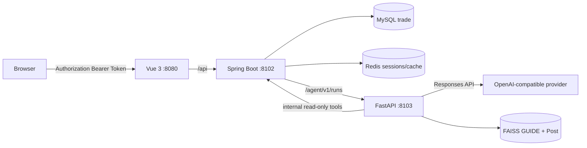

# 智能 AI 校园二手交易平台 v1.0

> 优化复现版，状态复核：2026-08-19。原项目作者：[程序员小白条](https://luoye6.github.io/)；本仓库 v1.0 由 @pmsjl 按新架构持续复现与优化。

这是一个 Vue 3 + Spring Boot + Python Agent 的校园二手交易平台。v1.0 保留市场、订单、公告和攻略社区主线，并将原来的单轮 AI/独立推荐页改造成受 Java 主后端控制的多轮 AI 导购与 GUIDE + Post RAG。

## 当前能力

### 用户端

- 注册、登录、退出与个人资料。
- 商品列表/详情、收藏、评分、购买、后续支付与个人订单。
- 公告浏览。
- 攻略 Post 列表、详情、搜索、发布、编辑、点赞、收藏与嵌套评论。
- 个人中心：我的帖子、评论、收藏、订单、购物日历与当前私信表面。
- AI 导购：多轮会话、会话归档/恢复、可选购买条件、推荐商品卡片、失败状态、RAG 来源详情与相关帖子。

### 管理端

- 用户、公告、商品、商品类别、订单与攻略管理。
- `/commodityOrder/add` 是管理员手工建单；普通用户购买不走该端点。

### 当前明确边界

- 私信仅实现 `add` 与 `my/list/page/vo`，没有未读数、撤回、删除或独立会话资源。
- AI 使用同步 JSON，不支持 SSE。
- GUIDE + Post RAG 已实现；管理员 knowledge job、文档 upsert/delete 与独立 retrieve HTTP API 仍是保留契约。
- 独立商品推荐页和 legacy 单轮 AI CRUD 不属于 v1.0 当前表面。
- Barrage/买家留言已从复现范围移除。

## 架构



- Vue 只访问 Java，不直连 Python。
- Java 负责鉴权、会话归属、业务数据库、真实商品/Post 字段与最终响应组装。
- Python 负责 Prompt、模型工具编排、Structured Outputs 与可降级 RAG，不直连业务 MySQL。
- 商品价格、库存、上架状态和 Post 展示字段在返回前由 Java 实时复核。

## 技术栈

### 前端

- Vue 3.2、TypeScript 4.5、Vue Router 4、Pinia
- Element Plus、Axios、ECharts、MD Editor V3
- Vue CLI 5、Sass、ESLint、Prettier

### Java 后端

- Spring Boot 3.4.3、Java 17、Maven
- MyBatis-Plus 3.5.9、MySQL 8、Redis、Redisson
- UUID Token 会话、`UserHolder`、`@AuthCheck`

### Python Agent

- FastAPI、Pydantic、OpenAI Responses 兼容客户端
- Structured Outputs、商品搜索、当前用户脱敏偏好工具
- Query Planner、Embedding、FAISS、不可变索引与 `CURRENT` 热加载

## 目录

```text
sharing-market-v1.0/
  market_frontend/    Vue 前端
  market_backend/     Java 主后端与 SQL
  ai_agent_service/   Python Agent 与 RAG
  docs/               UI 和语料进度文档
```

## 本地运行

### 1. 基础依赖

- Java 17、Maven
- Node.js 22.16.0 与 npm 10.9.2
- MySQL 8，schema `trade`
- Redis
- Python Conda 环境 `fastapi`

数据库、Redis、OSS、内部 Token、模型和 Embedding 地址均按本地环境配置。不要把真实密钥提交到仓库。

### 2. Java 主后端

```powershell
cd market_backend
Copy-Item src/main/resources/application.example.yml application-local.yml
$env:SPRING_CONFIG_ADDITIONAL_LOCATION = "optional:file:./application-local.yml"
mvn test
mvn spring-boot:run
```

首次运行时按本机环境填写未跟踪的 `application-local.yml`。该文件位于后端根目录，不会被打入 JAR。默认地址：`http://localhost:8102/api`。

### 3. Python Agent

参考 `ai_agent_service/.env.example` 准备本地 `.env`，然后运行：

```powershell
cd ai_agent_service
conda run -n fastapi python -m pytest -q
conda run -n fastapi uvicorn app.main:app --host 0.0.0.0 --port 8103
```

RAG 索引需要重建时：

```powershell
conda run -n fastapi python -m app.rag.rebuild_index
```

### 4. Vue 前端

```powershell
cd market_frontend
npm ci
npm run dev
```

默认地址：`http://localhost:8080`。

本地开发会优先读取未提交的 `.env.development.local`，因此不会因为仓库中的示例域名而失去本地调试能力。首次克隆后可执行：

```powershell
Copy-Item .env.development.local.example .env.development.local
```

然后按本机 Java 后端地址修改 `VUE_APP_API_BASE_URL`。`.env.development.local` 已被忽略，不要提交真实内网地址、密钥或其他机器配置。

### 部署到 Cloudflare Pages

本项目使用 Vue CLI，环境变量在**构建时**注入前端 bundle，而不是浏览器运行时动态读取。Cloudflare Pages 建议这样配置：

1. 在 Cloudflare Dashboard 打开 **Workers & Pages → Pages → 你的项目 → Settings → Builds & deployments**。
2. 将 **Root directory** 设置为 `market_frontend`（如果仓库根目录就是前端目录，则不需要填写）。
3. 在环境变量中设置 `SKIP_DEPENDENCY_INSTALL=1`，构建命令填写 `npm ci && npm run build`，构建输出目录填写 `dist`。项目通过 `.node-version` 固定使用 Node.js 22.16.0，并通过唯一的 `package-lock.json` 固定 npm 依赖树。
4. 在 **Settings → Environment variables** 中，分别切换 **Production** 和 **Preview**，新增：

   - **Name**：`VUE_APP_API_BASE_URL`
   - **Value**：实际部署的 Java API 地址，例如 `https://api.your-domain.example`
   - **Type**：`Text`

   该值不要填写 `http://localhost:8102`，也不要照抄仓库里的 `https://api.example.com`；后者只是可提交的占位示例域名。Production 应填写线上后端地址，Preview 可填写测试后端地址。
5. 如果使用 Cloudflare 的 **Production** 与 **Preview** 两套环境，两个环境都要分别保存变量。保存后执行 **Redeploy**；修改 Pages 环境变量不会改变已经生成的旧 bundle。
6. 部署后在浏览器开发者工具的 Network 中确认请求已经发往配置的 API 域名，而不是 `localhost`。同时确认后端已放行 Cloudflare Pages 的正式域名和预览域名 CORS。前端请求启用了 `withCredentials`，后端不能用 `Access-Control-Allow-Origin: *` 配合凭据请求，Cookie 的 `Secure`、`SameSite` 和域名策略也必须与跨域部署匹配。

仓库中的 `.env.development`、`.env.production` 和 `openapi.config.ts` 只保留 `https://api.example.com` 这种无效但安全的示例地址；本地地址放在 `.env.development.local`，线上真实地址放在 Cloudflare Pages 环境变量中。OpenAPI 代码生成如需访问本地文档地址，可先设置 `OPENAPI_SCHEMA_URL=http://localhost:8102/api/v2/api-docs` 再执行 `npm run openapi`；该变量不是前端运行时必需变量。

Java 与 Python 后端的生产变量、容器启动方式、健康检查和 RAG 持久化要求见 [`../docs/BACKEND_DEPLOYMENT.md`](../docs/BACKEND_DEPLOYMENT.md)。

## 验证

```powershell
# Python
cd ai_agent_service
conda run -n fastapi python -m pytest -q

# Java
cd market_backend
mvn test

# Vue
cd market_frontend
npm run lint
npm run build
```

2026-08-19 实测基线：

- Python：`103 passed`、`23 subtests passed`；受限工作区可能仅警告 `.pytest_cache` 不可写。
- Java：`38 tests`，全部通过。
- Vue：lint 无错误，生产构建成功。
- 生产构建仍有 42 条 Sass legacy API / `@import` 弃用与 bundle 体积警告，属于后续性能/依赖治理项。

## 关键文档

- [项目协作与当前 memory](../AGENTS.md)
- [AI Agent API 契约](../AI_AGENT_API.md)
- [AI Agent 当前复现与维护路线](../AI_AGENT_REPRODUCTION_GUIDE.md)
- [RAG 基础实现指南](../RAG_基础实现指南.md)
- [Python Agent README](../ai_agent_service/README.md)
- [UI 设计方案](../docs/UI_REDESIGN_PLAN.md)
- [UI 实施状态](../docs/UI_REDESIGN_PROGRESS.md)
- [Post 语料说明](../docs/post-corpus/README.md)

## 开发约定

- 真实前端调用优先于生成 API wrapper；未被调用的模板 CRUD 不自动进入复现范围。
- 普通用户购买走 `/commodity/buy`，需要后续支付时走 `/commodity/pay`。
- Long ID 在前端按字符串处理，避免 JavaScript 精度损失。
- 不信任模型生成的商品/Post 展示字段；必须使用 Java 查询结果。
- 不提交 `.env`、数据库密码、OSS 密钥、模型 Key 或内部服务 Token。
- 修改 v1.0 时不要同步改动只读参考项目 `../sharing-market/`。
